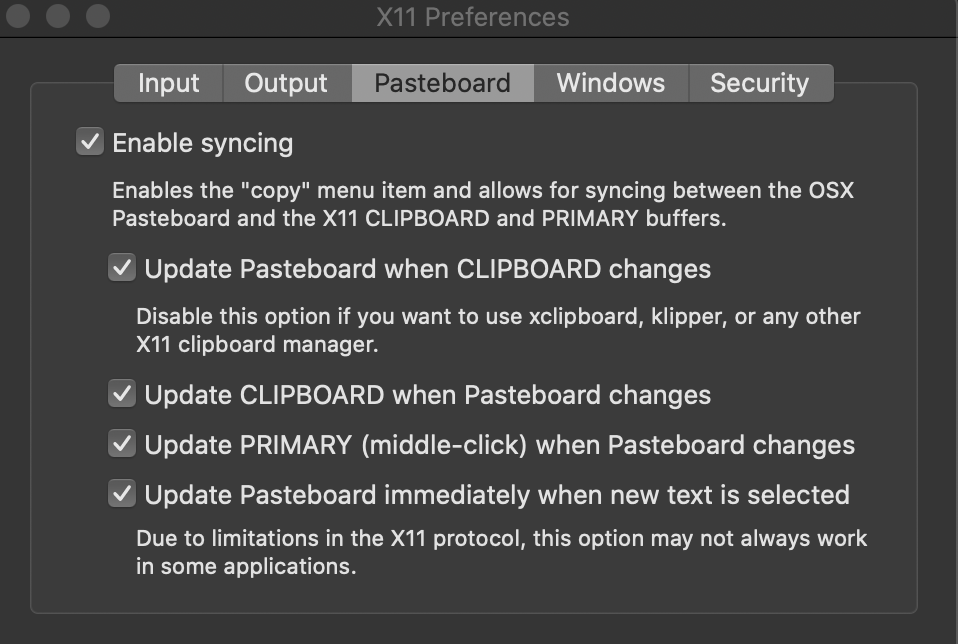

# workbench

https://github.com/XAMPPRocky/tokei
https://github.com/wting/autojump
https://github.com/cheat/cheat
https://github.com/dalance/procs

A development environment running in docker

## Starting the environment

### Building from source

`./scripts/workbenchBuild.sh`

### Running the container

`./scripts/workbenchRun.sh`

## Configuration

This container relies on X11 forwarding to sync its clipboard with he host the following settings have been shown to work for XQuartz

## Langages and Frameworks

- Dotnet 3.1
- GoLang 1.24.2
- NodeJS 14.4.0
- Python 3.8.2
- Ruby 2.7

## CLI Tools

A list of some of the cli tools installed. Some commonplace tools like `git`, `curl`, `wget` etc are not listed because but they are available.

| Tool                                                                                             | Description                                       |
| ------------------------------------------------------------------------------------------------ | ------------------------------------------------- |
| [autojump](https://github.com/wting/autojump)                                                    | file system navigation                            |
| [cowsay](https://web.archive.org/web/20071026043648/http://www.nog.net/~tony/warez/cowsay.shtml) | funny text filter                                 |
| [ctop](https://github.com/bcicen/ctop)                                                           | provides an overview of container metrics         |
| [htop](https://github.com/hishamhm/htop)                                                         | interactive process viewer                        |
| [httpie](https://github.com/jakubroztocil/httpie)                                                | HTTP client                                       |
| [jq](https://github.com/stedolan/jq)                                                             | JSON processor                                    |
| [mtr](https://github.com/traviscross/mtr)                                                        | combines functionality of 'traceroute' and 'ping' |
| [ncdu](https://dev.yorhel.nl/ncdu)                                                               | disk usage analyzer                               |
| [neovim](https://github.com/neovim/neovim)                                                       | modern vim                                        |
| [ranger](https://github.com/ranger/ranger)                                                       | console file manager with VI key bindings         |
| [ripgrep](https://github.com/BurntSushi/ripgrep)                                                 | line-oriented search tool                         |
| [neofetch](https://github.com/dylanaraps/neofetch)                                               | splash screens                                    |
| [tmux](https://github.com/tmux/tmux)                                                             | terminal multiplexer                              |
| [glances](https://nicolargo.github.io/glances/)                                                  | system monitoring                                 |
| [lazydocker](https://github.com/jesseduffield/lazydocker)                                        | terminal UI for docker                            |

## NeoVim Plugins

- [ale](https://github.com/dense-analysis/ale)
- [coc.nvim](https://github.com/neoclide/coc.nvim)
- [delimitMate](https://github.com/Raimondi/delimitMate)
- [fzf](https://github.com/junegunn/fzf.vim)
- [gruvbox-material](https://github.com/sainnhe/gruvbox-material)
- [gv](https://github.com/junegunn/gv.vim)
- [indentLine](https://github.com/Yggdroot/indentLine)
- [nerd-commenter](https://github.com/preservim/nerdcommenter)
- [nerdtree-git-plugin](https://github.com/Xuyuanp/nerdtree-git-plugin)
- [nerdtree](https://github.com/preservim/nerdtree)
- [omnisharp](https://github.com/OmniSharp/omnisharp-vim)
- [tagbar](https://github.com/majutsushi/tagbar)
- [ultisnips](https://github.com/SirVer/ultisnips)
- [vim-airline-themes](https://github.com/vim-airline/vim-airline-themes)
- [vim-airline](https://github.com/vim-airline/vim-airline)
- [vim-easy-align](https://github.com/junegunn/vim-easy-align)
- [vim-easymotion](https://github.com/easymotion/vim-easymotion)
- [vim-fugitive](https://github.com/tpope/vim-fugitive)
- [vim-gitgutter](https://github.com/airblade/vim-gitgutter)
- [vim-go](https://github.com/fatih/vim-go)
- [vim-qf](https://github.com/romainl/vim-qf)
- [vim-snippets](https://github.com/honza/vim-snippets)
- [vim-tmux-navigator](https://github.com/christoomey/vim-tmux-navigator)

# ShortCuts

| Command | Action                    |
| ------- | ------------------------- |
| `rn`    | start ranger file manager |
| `jp`    | pipe jq output into pager |
| `c`     | clear shell               |
| `k`     | kubectl                   |
| `mux`   | tmuxinator                |
| `eee`   | exit workbench            |

## Git

| Command | Action                  |
| ------- | ----------------------- |
| `gs`    | git status              |
| `gdt`   | git diff tool (icdiff)  |
| `gaa`   | git add all             |
| `gcmsg` | git commit with message |

## FZF

| Command  | Action            |
| -------- | ----------------- |
| `ctrl-t` | complete with fzf |
| `alt-c`  | fzf               |
| `fp`     | fzf with preview  |

## Tmux

| Command              | Action                                           |
| -------------------- | ------------------------------------------------ |
| `ctrl+b+w`           | list sessions and windows                        |
| `ctrl+b+q`           | list pane indexex                                |
| `ctrl+b+d`           | detach from session                              |
| `ctrl+b+space`       | change pane orientation (horizontal -> vertical) |
| `ctrl+b+{`           | swap panes up                                    |
| `ctrl+b+}`           | swap panes down                                  |
| `ctrl+b+M-1,2,3,4,5` | select layout                                    |

## Ranger File Explorer

### Sorting

| Command      | Action                                     |
| ------------ | ------------------------------------------ |
| ot           | sort by type first                         |
| os           | sort by size first                         |
| oa /oc /om   | sort by time                               |
| on           | sort natural                               |
| o{T/S/A/C/M} | sort in reverse order from the above modes |
| or           | reverse the sort order                     |

### File Commands

| Command | Action                                                             |
| ------- | ------------------------------------------------------------------ |
| fm      | mkdir                                                              |
| ft      | touch (create file)                                                |
| fe      | edit file (was E)                                                  |
| fl      | view file with less. q to quit (ranger `i` doesn't show full file) |
| fr      | rename                                                             |
| fb      | bulkrename                                                         |
| fp      | pyrenamer %d                                                       |

## Vim

### Movement

| Command         | Action                                                              |
| --------------- | ------------------------------------------------------------------- |
| `^`             | Move to first non-blank character in line.                          |
| `f a`           | Move forward to next instance of the 'a' character                  |
| `F a`           | Move backward to previous instance of the 'a' character             |
| `;`             | Repeat previous `forward` command.                                  |
| `f space`       | Move to next whitespace                                             |
| `H M L`         | Move to the top/middle/bottom of the screen (i.e. High/Middle/Low). |
| `''`            | Jump back to previous position                                      |
| `ctrl+o ctrl+i` | Jump back / forward through previous positions                      |
| `ctrl-y`        | Move screen up a line                                               |
| `ctrl-e`        | Move screen down a line                                             |
| `ctrl-u`        | Move screen up half a page                                          |
| `ctrl-d`        | Move screen down half a page                                        |
| `ctrl-b`        | Move screen up one page and cursor to last line                     |
| `ctrl-f`        | Move screen down one page and cursor to last line                   |

### Edit

| Command   | Action                                             |
| --------- | -------------------------------------------------- |
| `dw`      | delete to the next word                            |
| `dt,`     | delete up until the next comma on the current line |
| `de`      | delete to the end of the current word              |
| `d2e`     | delete to the end of next word                     |
| `dj`      | delete down a line (current and one below)         |
| `dt)`     | delete up until next closing parenthesis           |
| `d/rails` | delete up until the first search match for “rails” |

### Easy Motion

| Command    | Action       |
| ---------- | ------------ |
| `leader-w` | jump to word |

### Misc

| command                                     | list                                                    |
| ------------------------------------------- | ------------------------------------------------------- |
| `:!mkdir -p %:h`                            | when not exists, create directory for file              |
| `gv`                                        | redo last visual mode selection                         |
| `k`                                         | help for item under cursor                              |
| `.`                                         | repeat last command                                     |
| `> <`                                       | indent / un-indent block                                |
| `*`                                         | search for word under cursor                            |
| `ctrl+x`                                    | select value from `ctrl+x ctrl+o` for word under cursor |
| `:set syntax=go`                            | set file syntax                                         |
| `:set filetype=go`                          | set file type .                                         |
| `:'<,'>:s/=.//gc`                           | delete everything after = character                     |
| `:%!python -m json.tool`                    | format json                                             |
| `:verbose set conceallevel? concealcursor?` | determine what modified a setting                       |

### Working with registers

| Command   | Action                           |
| --------- | -------------------------------- |
| `"{a-z}y` | Yank to register                 |
| `"{A-Z}y` | Append yank to register          |
| `"{a-z}p` | Paste from register              |
| `:reg`    | Show contents of named registers |

### Macros

| Command                | Action                          |
| ---------------------- | ------------------------------- |
| `q<letter><commands>q` | Start recording macro           |
| `<number>@<letter>`    | Execute macro n number of times |
| `@@`                   | Repeat last macro               |

### Movement with Tags

| Command    | Action              |
| ---------- | ------------------- |
| `ctrl - [` | Jump to definition. |
| `ctrl - T` | Jump back.          |

### Marks

| Command   | Action                          |
| --------- | ------------------------------- |
| `m {a-z}` | Marks current position as {a-z} |
| `' {a-z}` | Move to position as {a-z}       |

### Syntax

| Command             | Action                      |
| ------------------- | --------------------------- |
| `:setlocal syntax?` | get syntax for current file |

### Buffers

| Command    | Action                            |
| ---------- | --------------------------------- |
| `:%bd\|e#` | close all buffers and reopen last |

### Windows

| Command    | Action                  |
| ---------- | ----------------------- |
| ` ctrl-w_` | maximize current window |

## Vim Plugins

### NerdCommenter

| Command           | Action                                                       |
| ----------------- | ------------------------------------------------------------ |
| [count]<leader>cc | Comment out the current line or text selected in visual mode |

### GV

A Git commit browser

| Command | Action                                                        |
| ------- | ------------------------------------------------------------- |
| `:GV`   | open git commit browser                                       |
| `:GV!`  | list commits that affected the current file                   |
| `:GV?`  | fill the location list with the revisions of the current file |

### Vim EasyAlign

| Command                   | Action                              |
| ------------------------- | ----------------------------------- |
| `gaip=`                   | align on first equal sign character |
| `gaip*=`                  | align all `=` characters            |
| <code>gaip\*&#124;</code> | align all pipe characters           |

### Vim FZF

| Command          | Action                                   |
| ---------------- | ---------------------------------------- |
| `Files [PATH]`   | Files (similar to `:FZF`)                |
| `GFiles [OPTS]`  | Git files (`git ls-files`)               |
| `GFiles?`        | Git files (`git status`)                 |
| `Buffers`        | Open buffers                             |
| `Colors`         | Color schemes                            |
| `Ag [PATTERN]`   | ag search result                         |
| `Rg [PATTERN]`   | rg search result                         |
| `Lines [QUERY]`  | Lines in loaded buffers                  |
| `BLines [QUERY]` | Lines in the current buffer              |
| `Tags [QUERY]`   | Tags in the project (`ctags -R`)         |
| `BTags [QUERY]`  | Tags in the current buffer               |
| `Marks`          | Marks                                    |
| `Windows`        | Windows                                  |
| `Locate PATTERN` | `locate` command output                  |
| `History`        | `v:oldfiles` and open buffers            |
| `History:`       | Command history                          |
| `History/`       | Search history                           |
| `Snippets`       | Snippets ([UltiSnips][us])               |
| `Commits`        | Git commits (requires [fugitive.vim][f]) |
| `BCommits`       | Git commits for the current buffer       |
| `Commands`       | Commands                                 |
| `Maps`           | Normal mode mappings                     |
| `Helptags`       | Show Help tags                           |

## Docker

### Resource Usage Table

`docker stats --format "table {{.Name}}\t{{.Container}}\t{{.CPUPerc}}\t{{.MemUsage}}"`
